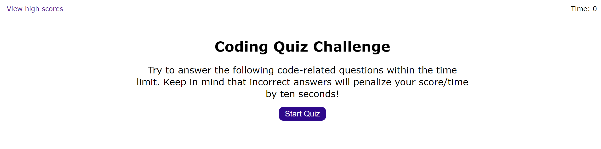

# JavaScript Coding Quiz

# Purpose
This is a game to test the coding skills. By setting time as a score and -10 seconds penalty, you'll have to answer correctly as fast as you can to beat your high score. So, this helps you establish your coding knowledge.

## Description
* When you click "Star Quiz" button, timer starts ticking from 75 seconds. 
    
* When answered, it will show the next question, and whether the answer was correct or wrong. 
    
    
* If the answer is incorrect, the timer will reduce itself by 10 seconds.
* When answered all the questions, it will show the final score and let you enter you initial to save into the local storage. 
    
* After saving score, it will show high scores. 
    
* To clear the high scores, click "Clear high scores" button. 
    
    
* Click "Go back" button to go back to the first screen.
* When clicked "View high scores", it will show high scores.

## Built With
* HTML
* CSS
* JavaScript

## Website
https://yurii92.github.io/yuri-s-coding-quiz/

